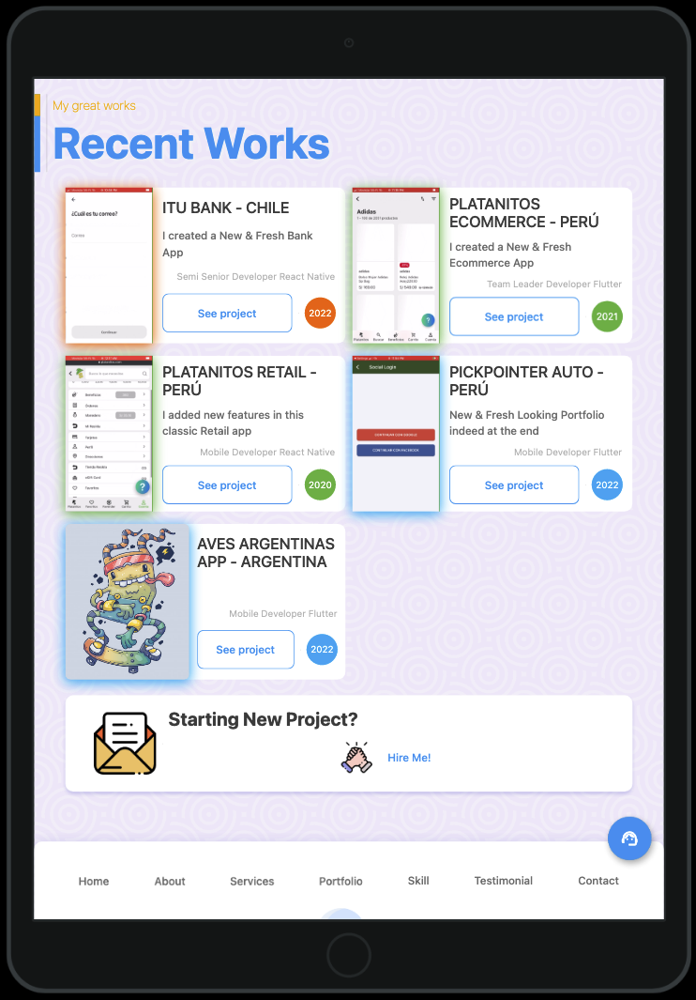

### I'm Binni Cordova, a Great Programmer

# MERCADOPAGO by BinniCordova

I'm currently using this package on my e-commerce and marketplace apps to process payments with cards.

## Contributions

Just call me to develop your project 💪🧑‍💻 and send me some money 💰💵💲 to support this report and update it.

[](https://binnicordova.com/)

ALSO, buy me fives coffees ☕️ 👀 to my 🧠🎸

[](https://www.buymeacoffee.com/binnicordova)

## Issues

Please file any issues, bugs, or feature requests in this repository.

## Features

- [*] Create customer
- [*] Search customer
- [ ] Delete customer

- [*] list cards
- [*] tokenize cards
- [*] save cards
- [*] delete cards

- [*] pay order

- [*] pay plan
- [*] list plans
- [*] subscribe to plan

## Getting started

EASY AND SIMPLE!

## Usage

### Pay Order
I wrote a nice UNIT TEST to simulate an order payment, you can read it on `test/checkout_test.dart`

```dart
CheckoutProvider paidMarketProvider = CheckoutProvider(
  authorization: auth,
);

UserModel user = const UserModel(
  firstName: 'Raul',
  lastName: 'Romero Diaz',
  document: '34127856',
  email: 'bin@gmail.com',
  idCountriesCodes: 'PE',
  phoneCode: "+51",
  phoneNumber: '987654321',
  idCountriesDocumentsTypes: 'DNI',
);
String orderUID = 'order-321';
double orderAmount = 100.00;

// SEARCH CUSTOMER
CustomerModel? customerModel =
    await paidMarketProvider.customerSearch(userModel: user);

expect(customerModel?.id, isNot(equals(null)));

// CARD
Card card = Card(
  id: null, // if this is defined so is a saved card
  save: false,
  installments: 1,
  customerId: customerModel!.id,
  cardNumber: '5031755734530604',
  cardholder: Cardholder(
    name: '${user.firstName} ${user.lastName}',
    identification: Identification(
      number: user.document,
      type: user.idCountriesDocumentsTypes,
    ),
  ),
  expirationYear: 2025,
  expirationMonth: 11,
  cvv: '123',
);
Map? response = await paidMarketProvider.customerCardTokenCreate(
  dataCard: card,
  email: user.email,
);
Card tokenizedCard = response!['data'] as Card;
expect(tokenizedCard.id, isNot(equals(null)));

// PAY ORDER
final PaymentResponseModel? paymentResponseModel =
    await paidMarketProvider.payOrder(
  dataCard: tokenizedCard,
  userModel: user,
  orderNumber: orderUID,
  amount: orderAmount,
);

if (paymentResponseModel?.statusDetail ==
    PaidMarketStatusTypeEnum.Accredited.value) {
  expect(paymentResponseModel?.statusDetail,
      equals(PaidMarketStatusTypeEnum.Accredited.value));
} else if (paymentResponseModel?.statusDetail ==
        PaidMarketStatusTypeEnum.PendingContingency.value ||
    paymentResponseModel?.statusDetail ==
        PaidMarketStatusTypeEnum.PendingReviewManual.value) {
  expect(
    paymentResponseModel?.statusDetail,
    equals(PaidMarketStatusTypeEnum.PendingContingency.value),
  );
} else {
  expect(
    paymentResponseModel?.statusDetail,
    isNot(equals(PaidMarketStatusTypeEnum.Accredited.value)),
  );
  expect(
    paymentResponseModel?.statusDetail,
    isNot(equals(PaidMarketStatusTypeEnum.PendingContingency.value)),
  );
  expect(
    paymentResponseModel?.statusDetail,
    isNot(equals(PaidMarketStatusTypeEnum.PendingReviewManual.value)),
  );
}

// DELETE CARD (only if necesary)
if (tokenizedCard.save == false) {
  paidMarketProvider.customerCardDelete(dataCard: tokenizedCard);
}
```

### Subscription
I wrote a nice UNIT TEST to simulate a subscription, you can read it on `test/subscription_test.dart`

```dart
SubscriptionProvider subscriptions =
        SubscriptionProvider(authorization: auth);
CheckoutProvider paidMarketProvider = CheckoutProvider(
  authorization: auth,
);

UserModel user = const UserModel(
  firstName: 'Raul',
  lastName: 'Romero Diaz',
  document: '34127856',
  email: 'bin@gmail.com',
  idCountriesCodes: 'PE',
  phoneCode: "+51",
  phoneNumber: '987654321',
  idCountriesDocumentsTypes: 'DNI',
);

// SEARCH CUSTOMER
CustomerModel? customerModel =
    await paidMarketProvider.customerSearch(userModel: user);

expect(customerModel?.id, isNot(equals(null)));

// CARD
Card card = Card(
  id: null, // if this is defined so is a saved card
  customerId: customerModel!.id,
  cardNumber: '5031755734530604',
  cardholder: Cardholder(
    name: '${user.firstName} ${user.lastName}',
    identification: Identification(
      number: user.document,
      type: user.idCountriesDocumentsTypes,
    ),
  ),
  expirationYear: 2025,
  expirationMonth: 11,
  cvv: '123',
);
Map? response = await paidMarketProvider.customerCardTokenCreate(
  dataCard: card,
  email: user.email,
);

print(response);

Card tokenizedCard = response!['data'] as Card;

// PLAN
String? planId =
    await subscriptions.createPlan(reason: 'gold_suscription', amount: 100);

// SUSCRIPTION
String? userSuscriptionId = await subscriptions.createSubscription(
  reason: 'gold_suscription_service',
  planId: planId!,
  externalReference: 'uid',
  userModel: user,
  card: tokenizedCard,
);

expect(userSuscriptionId, isNot(equals(null)));
```

## Copyright

Copyright (c) 2023 Binni Cordova
See LICENSE for details